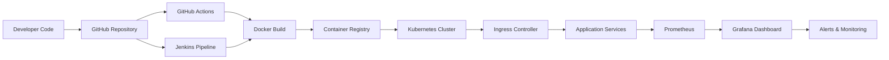

<!-- ========================================================= -->
<!--                PREMIUM DYNAMIC GITHUB PROFILE             -->
<!-- ========================================================= -->
<!-- Replace all placeholders before using                     -->
<!-- Praveen Pathange                                                 -->
<!-- PraveenPatange                                      -->
<!-- YOUR_ROLE                                                 -->
<!-- Hyderabad                                             -->
<!-- praveenrao556@gmail.com                                                -->
<!-- YOUR_LINKEDIN                                             -->                                            -->
<!-- YOUR_PORTFOLIO                                            -->
<!-- ========================================================= -->

<div align="center">


<br/>


</div>

---

#  About Me


```yaml
Name: Praveen Pathange
Role: sr systems operations engineer
Location: Hyderabad

Specialization:
  - DevOps Engineering
  - Cloud Infrastructure
  - Kubernetes Administration
  - CI/CD Automation
  - Platform Engineering

Current Focus:
  - Kubernetes Production Deployments
  - Terraform Automation
  - GitOps Workflows
  - Cloud Security
  - Observability Stack

Learning:
  - Advanced Kubernetes
  - Service Mesh
  - SRE Practices
  - Multi-Cloud Architecture
```

### 🚀 What I Do

- ⚙️ Automating infrastructure using **Terraform & IaC**
- ☁️ Designing scalable architectures on **AWS & GCP**
- 🚢 Managing containerized workloads with **Kubernetes**
- 🔄 Building robust **CI/CD pipelines**
- 📊 Implementing monitoring with **Prometheus & Grafana**
- 🔐 Improving cloud security & deployment reliability
- 🌍 Exploring modern **Cloud Native Ecosystem**

---

#  Tech Stack

<div align="center">

## ☁️ Cloud Platforms


---

## ⚙️ DevOps & Infrastructure


---

## 💻 Programming & Scripting


---

## 📊 Monitoring & Observability


---

## 🗄️ Databases


---

## 🛠️ Development Tools


</div>

---

# 📊 GitHub Analytics

<div align="center">


</div>

---

<div align="center">


</div>

---

# 📈 Contribution Graph

<div align="center">


</div>

---

# 🏆 GitHub Achievements

<div align="center">


</div>

---

# 🚀 Featured DevOps Projects

<div align="center">

| 🚀 Project | 📄 Description | ⚡ Stack |
|---|---|---|
| **Kubernetes Deployment Automation** | Automated production-grade Kubernetes deployments using Helm & GitOps | `Kubernetes` `Helm` `ArgoCD` |
| **Terraform AWS Infrastructure** | Reusable Terraform modules for scalable AWS provisioning | `Terraform` `AWS` |
| **CI/CD Pipeline Project** | Complete CI/CD workflow automation with secure deployments | `Jenkins` `GitHub Actions` |
| **Monitoring Stack Setup** | Observability platform using Prometheus & Grafana | `Prometheus` `Grafana` |

</div>

---

# 🧠 DevOps Workflow Architecture

<div align="center">



</div>

---

# 📚 Learning Roadmap

<div align="center">

| Technology | Progress |
|---|---|
| Kubernetes Advanced Concepts | ██████████░░ 80% |
| Terraform Enterprise | █████████░░░ 75% |
| GitOps & ArgoCD | ████████░░░░ 65% |
| Platform Engineering | ███████░░░░░ 60% |
| Service Mesh (Istio) | █████░░░░░░░ 40% |

</div>

---

# 🎓 Certifications

<div align="center">


</div>

---

# 🐍 Contribution Snake Animation

<div align="center">


</div>

---

# ✍️ Latest Blog Posts

```text
🚀 Coming Soon...
Automated blog integration via GitHub Actions
DevOps Tutorials | Kubernetes Notes | Cloud Architecture
```

---

# 🌐 Connect With Me

<div align="center">

<a href="https://linkedin.com/in/YOUR_LINKEDIN">

</a>

<a href="https://github.com/YOUR_GITHUB_USERNAME">

</a>

<a href="https://twitter.com/YOUR_TWITTER">

</a>

<a href="https://YOUR_PORTFOLIO.com">

</a>

<a href="mailto:YOUR_EMAIL">

</a>

</div>

---

# ⚡ Fun DevOps Metrics

<div align="center">


</div>

---

# 💡 DevOps Philosophy

<div align="center">

### “Automate everything possible.  
### Monitor everything critical.  
### Scale everything reliably.”

</div>

---

<div align="center">


## ⭐ Thanks for visiting my profile!

</div>
